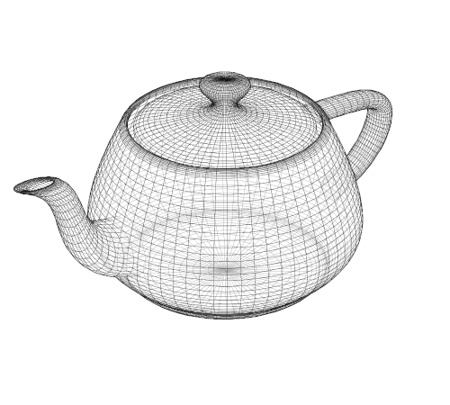
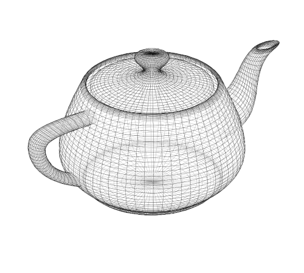
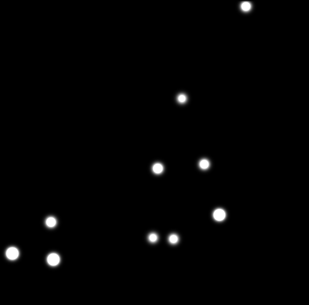

[//]: # (Construct `<a name="performance-1"></a>` is used to disambiguate internal links)
[//]: # (This is not required for unambiguous links, `markdown` and/or `gitlit` can deal with these)


# Examples

## Contents

* [Overview of Examples](#overview-of-examples)
* [Example 1: Euclid's Algorithm](#example-1-euclids-algorithm)
    * [Scalar version](#scalar-version)
    * [Vector version 1](#vector-version-1)
    * [Invoking the QPUs](#invoking-the-qpus)
    * [Vector version 2: loop unrolling](#vector-version-2-loop-unrolling)
* [Example 2: 3D Rotation](#example-2-3d-rotation)
    * [Scalar version](#scalar-version-1)
    * [Vector version 1](#vector-version-1-1)
    * [Vector version 2: non-blocking loads and stores](#vector-version-2-non-blocking-loads-and-stores)
    * [Performance](#performance)
* [Example 3: 2D Convolution (Heat Transfer)](#example-3-2d-convolution-heat-transfer)
    * [Scalar version](#scalar-version-2)
    * [Vector version](#vector-version)
    * [Performance](#performance-1)


## Overview of Examples

To build and run an example:

```
make QPU=1 <name>
sudo obj/qpu/bin/<name>
```

Interesting examples (there are more):

- **GCD**       - [Euclid's algorithm](https://en.wikipedia.org/wiki/Euclidean_algorithm), The GCD's of some random pairs of integers
- **Tri**       - Computes [triangular numbers](https://en.wikipedia.org/wiki/Triangular_number), using two kernels:
  1. with integer in- and output
  2. with float in- and output
- **OET**       - [Odd-even transposition sorter](https://en.wikipedia.org/wiki/Odd%E2%80%93even_sort) for 32 integers
- **HeatMap**   - Modelling heat flow across a 2D surface; outputs an image in [pgm](http://netpbm.sourceforge.net/doc/pgm.html) format, and notes the time taken
- **Rot3D**     -  3D rotation of a random object; outputs the time taken


## Example 1: Euclid's Algorithm

Given a pair of positive integers larger than zero, 
[Euclid's algorithm](https://en.wikipedia.org/wiki/Euclidean_algorithm).
computes the largest integer that divides into both without a
remainder, also known as the *greatest common divisor*, or GCD for
short.

We present two versions of the algorithm:

  1. a **scalar** version that runs on the ARM CPU and computes a
     single GCD; and

  2. a **vector** version that runs on a single QPU and computes 16
     different GCDs in parallel.

### Scalar version

In plain C++, we can express the algorithm as follows.

```C++
void gcd(int* p, int* q, int* r) {
  int a = *p;
  int b = *q;

  while (a != b) {
    if (a > b) 
      a = a-b;
    else
      b = b-a;
  }
  *r = a;
}
```

Admittedly, it's slightly odd to write `gcd` in this way, operating
on pointers to integers rather than integers directly.  However, it
prepares the way for the vector version which operates on 
*arrays* of inputs and outputs.

### Vector version 1

Using `V3DLib`, the algorithm looks as follows.

```c++
#include <V3DLib.h>

void gcd(Ptr<Int> p, Ptr<Int> q, Ptr<Int> r) {
  Int a = *p;
  Int b = *q;
  While (any(a != b))
    Where (a > b)
      a = a-b;
    End
    Where (a < b)
      b = b-a;
    End
  End
  *r = a;
}
```

This example introduces a number of concepts:

  * the `Int` type denotes a 16-element vector of 32-bit integers;
  * the `Ptr<Int>` type denotes a 16-element vector of *addresses* of
    `Int` vectors;
  * the expression `*p` denotes the `Int` vector in memory starting at address
    <tt>p<sub>0</sub></tt>, i.e. starting at the *first* address in the
    vector `p`;
  * the expression `a != b` computes a vector of booleans via a 
    pointwise comparison of vectors `a` and `b`;
  * the condition `any(a != b)` is true when *any* of the booleans in the
    vector `a != b` are true;
  * the statement `Where (a > b) a = a-b; End` is a conditional assigment:
    only elements in vector `a` for which `a > b` holds will be
    modified.

It's worth reiterating that `V3dLib` is just standard C++ code: there
are no pre-processors being used other than the standard C pre-processor.
All the `V3DLib` language constructs are simply classes, functions, and macros exported by `V3DLib`.
This kind of language is called a
[Domain Specific Embedded Language](http://cs.yale.edu/c2/images/uploads/dsl.pdf).


### Invoking the QPUs

The following program computes 16 GCDs in parallel on a single QPU:

```c++
int main() {
  // Compile the gcd function to a QPU kernel k
  auto k = compile(gcd);

  // Allocate and initialise arrays shared between CPU and QPUs
  SharedArray<int> a(16), b(16), r(16);

  // Initialise inputs to random values in range 100..199
  srand(0);
  for (int i = 0; i < 16; i++) {
    a[i] = 100 + rand()%100;
    b[i] = 100 + rand()%100;
  }

  // Set the number of QPUs to use
  k.setNumQPUs(1);

  // Invoke the kernel
  k(&a, &b, &r);

  // Display the result
  for (int i = 0; i < 16; i++)
    printf("gcd(%i, %i) = %i\n", a[i], b[i], r[i]);
  
  return 0;
}
```

Explanation:

  * `compile()` takes a function defining a QPU computation and returns a
    CPU-side handle that can be used to invoke it;
  * the handle `k` is of type `Kernel<Ptr<Int>, Ptr<Int>,
    Ptr<Int>>`, capturing the types of `gcd`'s parameters,
    but we use the `auto` keyword to avoid clutter;
  * when the kernel is invoked by writing `k(&a, &b, &r)`, `V3DLib` 
    automatically converts CPU values of type
    `SharedArray<int>*` into QPU values of type `Ptr<Int>`;
  * Type `SharedArray&lt;&alpha;&gt;` type is used to allocate
    memory that is accessed by both the CPU and the QPUs:
    memory allocated with `new` and `malloc()` will not be accessible from the QPUs.

Running this program produces the output:

```
gcd(183, 186) = 3
gcd(177, 115) = 1
gcd(193, 135) = 1
gcd(186, 192) = 6
gcd(149, 121) = 1
gcd(162, 127) = 1
gcd(190, 159) = 1
gcd(163, 126) = 1
gcd(140, 126) = 14
gcd(172, 136) = 4
gcd(111, 168) = 3
gcd(167, 129) = 1
gcd(182, 130) = 26
gcd(162, 123) = 3
gcd(167, 135) = 1
gcd(129, 102) = 3
```

### Vector version 2: loop unrolling

[Loop unrolling](https://en.wikipedia.org/wiki/Loop_unrolling) is a
technique for improving performance by reducing the number of costly
branch instructions executed.

The QPU's branch instruction is costly: it requires three
[delay slots](https://en.wikipedia.org/wiki/Delay_slot) (that's 12 clock cycles),
and this project currently makes no attempt to fill these slots with useful work.
Although loop unrolling is not done automaticlly,
it is straightforward use a C++ loop to generate multiple QPU statements.

```c++
void gcd(Ptr<Int> p, Ptr<Int> q, Ptr<Int> r) {
  Int a = *p;
  Int b = *q;
  While (any(a != b))
    // Unroll the loop body 32 times
    for (int i = 0; i < 32; i++) {
      Where (a > b)
        a = a-b;
      End
      Where (a < b)
        b = b-a;
      End
    }
  End
  *r = a;
}
```


## Example 2: 3D Rotation

This example illustrates a routine to rotate 3D objects.

([OpenGL ES](https://www.raspberrypi.org/documentation/usage/demos/hello-teapot.md)
is probably a better idea for this if you need to rotate a lot.
This example is just for illustration purposes)

If this is applied to the vertices of
[Newell's teapot](https://github.com/rm-hull/newell-teapot/blob/master/teapot)
(rendered using [Richard Hull's wireframes](https://github.com/rm-hull/wireframes) tool)



with &theta; = 180 degrees, the result is:




### <a name="scalar-version-1">Scalar version</a>

The following function will rotate `n` vertices about the Z axis by
&theta; degrees.

```c++
void rot3D(int n, float cosTheta, float sinTheta, float* x, float* y) {
  for (int i = 0; i < n; i++) {
    float xOld = x[i];
    float yOld = y[i];
    x[i] = xOld * cosTheta - yOld * sinTheta;
    y[i] = yOld * cosTheta + xOld * sinTheta;
  }
}
```

### <a name="vector-version-1-1"></a>  Vector version 1

This first vector version is almost identical to the scalar version above.
The only difference is that each loop iteration now processes 16 vertices at a time rather than a single vertex.

```c++
void rot3D(Int n, Float cosTheta, Float sinTheta, Ptr<Float> x, Ptr<Float> y) {
  For (Int i = 0, i < n, i = i+16)
    Float xOld = x[i];
    Float yOld = y[i];
    x[i] = xOld * cosTheta - yOld * sinTheta;
    y[i] = yOld * cosTheta + xOld * sinTheta;
  End
}
```

This simple solution will spend a lot of time blocking on the memory subsystem, waiting for vector loads and stores to complete.
To get good performance on a QPU, it is desirable to overlap memory access with computation;
the current `V3DLib` version is not good at this yet (TODO!).
*Non-blocking* load and store operations, however, can be added explicitly.

### Vector version 2: non-blocking loads and stores

`V3DLib` supports non-blocking loads through these functions:

  * `gather(p)`   - Given a vector of addresses `p`, *request* the value at each address in `p`.
                    Will block if all corresponding `receive()` calls have not been completed.
  * `receive(x)`  - Loads values collected by `gather(p)` and stores these in `x`.
                    Will block if the values are not yet available.
  * `store(x, p)` - Given vector of addresses `p` and a vector `x`,
                    write vector `x` to the memory beginning at the first address in `p`.
                    Will block until a previous `store()` has completed, iotherwise does not block QPU execution.

Between `gather(p)` and `receive(x)` the program is free to perform computation *in parallel*
with the (slow) memory accesses.

Inside the QPU, an 4-element FIFO is used to hold `gather`
requests: each call to `gather` will enqueue the FIFO, and each call
to `receive` will dequeue it.  This means that a maximum of four
`gather` calls may be issued before a `receive` must be called.

For `vc4`, unlike the statement `*p = x`, the statement `store(p, x)` does not wait until `x` has been written.
Future improvements to `V3DLib` could allow several outstanding stores instead of just one.

A vectorised rotation routine that overlaps memory access with computation might be as follows:

```c++
void rot3D_2(Int n, Float cosTheta, Float sinTheta, Ptr<Float> x, Ptr<Float> y) {
  Int inc = numQPUs() << 4;
  Ptr<Float> p = x;
  Ptr<Float> q = y;
  gather(p); gather(q);
 
  Float xOld, yOld;
  For (Int i = 0, i < n, i = i+inc)
    gather(p+inc); gather(q+inc); 
    receive(xOld); receive(yOld);
    store(xOld * cosTheta - yOld * sinTheta, p);
    store(yOld * cosTheta + xOld * sinTheta, q);
    p = p+inc; q = q+inc;
  End

  receive(xOld); receive(yOld);
}
```

While the outputs from one iteration are being computed and written to
memory, the inputs for the *next* iteration are being loaded *in parallel*.

Variable `inc` is there to take into account multiple QPU's running.
Each QPU will handle a distinct block of 16 elements.

### Performance

Times taken to rotate an object with 192,000 vertices:
(**TODO** Make a test case using the actual Example program with supplied inputs)

```
  Version  | Number of QPUs | Run-time (s) |
  ---------| -------------: | -----------: |
  Scalar   | 0              | 0.018        |
  Vector 1 | 1              | 0.040        |
  Vector 2 | 1              | 0.018        |
  Vector 3 | 1              | 0.018        |
  Vector 3 | 2              | 0.016        |
```

Non-blocking loads and stores (vector version 2) give a
significant performance boost: in this case a factor of 2.

This program does not scale well to multiple QPUs.  
This is likely becaue the compute-to-memory ratio is too low:
only 2 arithmetic operations are done for every memory access, perhaps overwhelming the memory subsystem.

Example `Mandelbrot` had a much better compute-to-memory ratio, and is therefore a better candidate for
measuring performance with respect to scaling.

## Example 3: 2D Convolution (Heat Transfer)

This example models the heat flow across a 2D surface.
[Newton's law of cooling](https://en.wikipedia.org/wiki/Newton%27s_law_of_cooling)
states that an object cools at a rate proportional to the difference
between its temperature `T` and the temperature of its environment (or
ambient temperature) `A`:

```
   dT/dt = −k(T − A)
```

In the simulation, each point on the 2D surface to be a separate object,
and the ambient temperature of each object to be the average of the temperatures of the 8 surrounding objects.
This is very similar to 2D convolution using a mean filter.

The `HeatMap` example program initializes a number of heat points and then
iteratively calculates the diffusion. The default implementation starts out
as follows:


After 100 iterations, this becomes:



After 1500 iterations, this becomes:


### <a name="scalar-version-2"></a> Scalar version

The following function simulates a single time-step of the
differential equation, applied to each object in the 2D grid.

```c++
void step(float** grid, float** gridOut, int width, int height) {
  for (int y = 1; y < height-1; y++) {
    for (int x = 1; x < width-1; x++) {
      float surroundings =
        grid[y-1][x-1] + grid[y-1][x]   + grid[y-1][x+1] +
        grid[y][x-1]   +                  grid[y][x+1]   +
        grid[y+1][x-1] + grid[y+1][x]   + grid[y+1][x+1];
      surroundings *= 0.125;
      gridOut[y][x] = grid[y][x] - (K * (grid[y][x] - surroundings));
    }
  }
}
```


### Vector version

This introduces the concept of a **cursor**, which is useful for implementing sliding window algorithms.

A cursor points to a window of three continguous vectors in memory: `prev`, `current` and `next`.

```
  cursor  ------>  +---------+---------+---------+
                   |  prev   | current |  next   |
                   +---------+---------+---------+
                 +0:      +16:      +32:      +48:
```

and supports three main operations:

  1. **advance** the cursor by one vector, i.e. slide the window right
     by one vector;

  2. **shift-left** the `current` vector by one element,
     using the value of the `next` vector;

  3. **shift-right** the `current` vector by one element,
     using the value of the `prev` vector.

Here is a `V3DLib` implementation of a cursor, using a C++ class.

```c++
class Cursor {
  Ptr<Float> cursor;
  Float prev, current, next;

 public:

  // Initialise to cursor to a given pointer
  // and fetch the first vector.
  void init(Ptr<Float> p) {
    gather(p);
    current = 0;
    cursor = p+16;
  }

  // Receive the first vector and fetch the second.
  // (prime the software pipeline)
  void prime() {
    receive(next);
    gather(cursor);
  }

  // Receive the next vector and fetch another.
  void advance() {
    cursor = cursor+16;
    prev = current;
    gather(cursor);
    current = next;
    receive(next);
  }

  // Receive final vector and don't fetch any more.
  void finish() {
    receive(next);
  }

  // Shift the current vector left one element
  void shiftLeft(Float& result) {
    result = rotate(current, 15);
    Float nextRot = rotate(next, 15);
    Where (index() == 15)
      result = nextRot;
    End
  }

  // Shift the current vector right one element
  void shiftRight(Float& result) {
    result = rotate(current, 1);
    Float prevRot = rotate(prev, 1);
    Where (index() == 0)
      result = prevRot;
    End
  }
};
```

Given a vector `x`, the operation `rotate(x, n)` will rotate
`x` right by `n` places where `n` is a integer in the range 0 to 15.
Noe that rotating right by 15 is the same as rotating left by 1.

The vectorised simulation step using cursors is expressed below.
A difference from the scalar version is that the grid is not a 2D array:
it is instead 1D array with a `pitch` parameter that gives the increment needed to get
from the start of one row to the start of the next.

```C++
void step(Ptr<Float> grid, Ptr<Float> gridOut, Int pitch, Int width, Int height) {
  Cursor row[3];
  grid = grid + pitch*me() + index();

  // Skip first row of output grid
  gridOut = gridOut + pitch;

  For (Int y = me(), y < height, y=y+numQPUs())
    // Point p to the output row
    Ptr<Float> p = gridOut + y*pitch;

    // Initilaise three cursors for the three input rows
    for (int i = 0; i < 3; i++) row[i].init(grid + i*pitch);
    for (int i = 0; i < 3; i++) row[i].prime();

    // Compute one output row
    For (Int x = 0, x < width, x=x+16)

      for (int i = 0; i < 3; i++) row[i].advance();

      Float left[3], right[3];
      for (int i = 0; i < 3; i++) {
        row[i].shiftLeft(right[i]);
        row[i].shiftRight(left[i]);
      }

      Float sum = left[0] + row[0].current + right[0] +
                  left[1] +                  right[1] +
                  left[2] + row[2].current + right[2];

      store(row[1].current - K * (row[1].current - sum * 0.125), p);
      p = p + 16;

    End

    // Cursors are finished for this row
    for (int i = 0; i < 3; i++) row[i].finish();

    // Move to the next input rows
    grid = grid + pitch*numQPUs();
  End
}
```

### <a name="performance-1"></a> Performance

Times taken to simulate a 512x512 surface for 2000 steps:

```
  Version | Number of QPUs | Run-time (s) |
  --------| -------------: | -----------: |
  Scalar  | 0              | 431.46       |
  Vector  | 1              | 49.34        |
  Vector  | 2              | 24.91        |
  Vector  | 4              | 20.36        |
```
